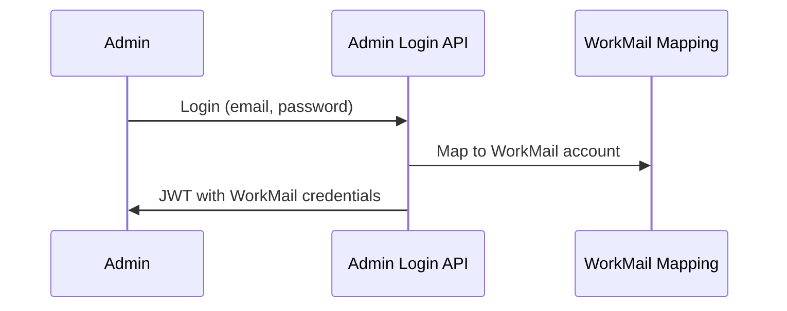
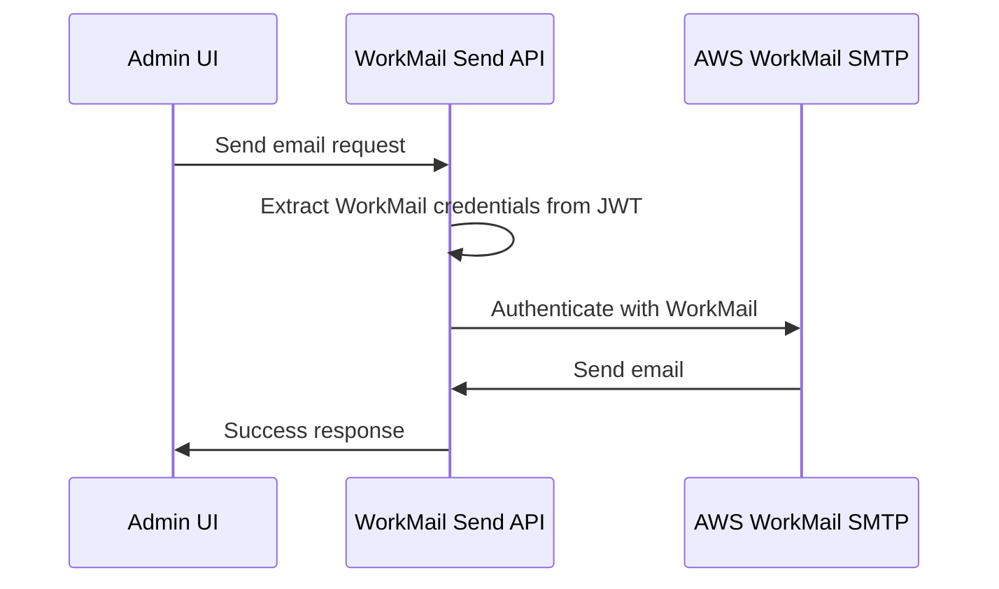
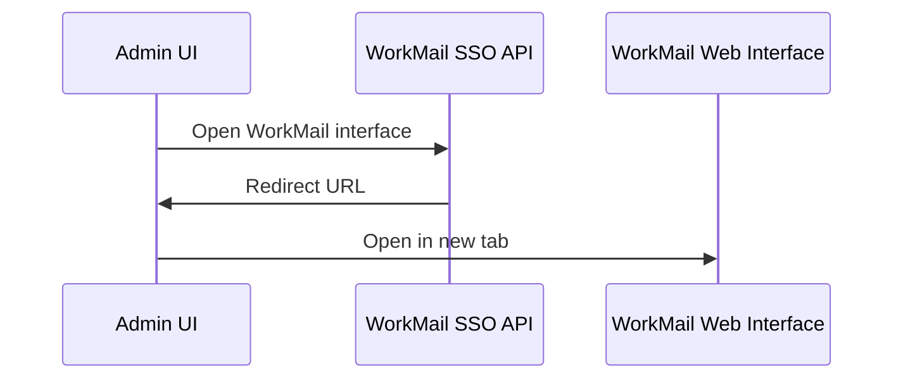

# AWS WorkMail SSO Integration für Taskilo Admin Dashboard

## Überblick

Die WorkMail SSO Integration ermöglicht es Admin-Benutzern, sich automatisch mit ihren WorkMail-Konten zu authentifizieren, wenn sie sich im Taskilo Admin Dashboard anmelden. Dies eliminiert die Notwendigkeit separater Login-Credentials für E-Mail-Funktionen.

## Architektur

### 1. Admin-Login mit WorkMail-Mapping

Beim Admin-Login wird automatisch eine Zuordnung zu WorkMail-E-Mail-Adressen erstellt:

```typescript
const workmailEmailMapping = {
  'andy.staudinger@taskilo.de': 'andy.staudinger@taskilo.de',
  'admin@taskilo.de': 'support@taskilo.de', 
  'support@taskilo.de': 'support@taskilo.de'
};
```

### 2. SSO Token mit WorkMail-Credentials

Das JWT-Token wird erweitert um WorkMail-Informationen:

```typescript
const token = await new SignJWT({
  email: user.email,
  name: user.name,
  role: user.role,
  workmailEmail: workmailEmail,
  workmailIntegration: true,
  iat: Math.floor(Date.now() / 1000),
}).sign(JWT_SECRET);
```

### 3. WorkMail-Credential-Verwaltung

WorkMail-Passwörter werden sicher über Environment-Variablen verwaltet:

```bash
WORKMAIL_ANDY_PASSWORD=secure_password_for_andy
WORKMAIL_SUPPORT_PASSWORD=secure_password_for_support
```

## API-Endpunkte

### `/api/admin/workmail/sso` (GET)
- **Zweck**: Abrufen der WorkMail SSO-Informationen für den eingeloggten Admin
- **Authentifizierung**: Erfordert gültiges Admin JWT-Token
- **Response**: WorkMail-Credentials und Konfiguration

### `/api/admin/workmail/sso` (POST)
- **Zweck**: WorkMail SSO-Aktionen durchführen
- **Aktionen**:
  - `get_workmail_token`: Temporären WorkMail-Access-Token generieren
  - `open_workmail_interface`: WorkMail Web Interface öffnen

### `/api/admin/workmail/send` (POST)
- **Zweck**: E-Mails über WorkMail SMTP senden
- **Authentifizierung**: Verwendet automatisch Admin-WorkMail-Credentials
- **Parameter**: `to`, `subject`, `htmlContent`, `textContent`, `from`

## Sicherheitsfeatures

### 1. Credential-Mapping
- Sichere Zuordnung von Admin-Accounts zu WorkMail-Benutzern
- Keine Klartext-Passwörter im Code
- Environment-basierte Credential-Verwaltung

### 2. Session-basierte Authentifizierung
- WorkMail-Zugriff nur bei gültiger Admin-Session
- Automatische Token-Validierung
- Sichere Cookie-Verwaltung

### 3. Rollenbasierte Berechtigung
- Unterschiedliche WorkMail-Rollen für verschiedene Admin-Level
- Granulare Zugriffskontrolle
- Audit-Trail für E-Mail-Aktivitäten

## Workflow

### 1. Admin-Login


### 2. E-Mail versenden


### 3. WorkMail Interface


## Environment-Konfiguration

```bash
# WorkMail SMTP Credentials
WORKMAIL_ANDY_PASSWORD=secure_password_for_andy
WORKMAIL_SUPPORT_PASSWORD=secure_password_for_support

# Admin JWT Secret
ADMIN_JWT_SECRET=taskilo-admin-secret-key-2024

# AWS WorkMail Configuration
AWS_WORKMAIL_ORGANIZATION=taskilo-org
AWS_WORKMAIL_DOMAIN=taskilo.de
AWS_WORKMAIL_SMTP_HOST=smtp.mail.us-east-1.awsapps.com
AWS_WORKMAIL_WEB_URL=https://taskilo-org.awsapps.com/mail
```

## Frontend-Integration

### 1. SSO Status Check
```typescript
const checkSSOStatus = async () => {
  const response = await fetch('/api/admin/workmail/sso');
  const result = await response.json();
  
  if (result.success) {
    console.log('WorkMail SSO aktiv für:', result.workmail.email);
  }
};
```

### 2. E-Mail senden mit SSO
```typescript
const sendEmail = async (emailData) => {
  const response = await fetch('/api/admin/workmail/send', {
    method: 'POST',
    headers: { 'Content-Type': 'application/json' },
    body: JSON.stringify(emailData)
  });
  
  // Verwendet automatisch Admin-WorkMail-Credentials
  return response.json();
};
```

### 3. WorkMail Interface öffnen
```typescript
const openWorkMailInterface = async () => {
  const response = await fetch('/api/admin/workmail/sso', {
    method: 'POST',
    headers: { 'Content-Type': 'application/json' },
    body: JSON.stringify({ action: 'open_workmail_interface' })
  });
  
  const result = await response.json();
  if (result.success) {
    window.open(result.redirectUrl, '_blank');
  }
};
```

## Vorteile der SSO-Integration

### 1. Benutzerfreundlichkeit
- Ein Login für Admin-Dashboard und E-Mail-System
- Nahtlose E-Mail-Funktionalität
- Keine separate Credential-Verwaltung

### 2. Sicherheit
- Zentrale Authentifizierung
- Sichere Credential-Speicherung
- Session-basierte Zugriffskontrolle

### 3. Wartbarkeit
- Einfache Benutzer-Verwaltung
- Konsistente Authentifizierung
- Skalierbare Architektur

## Monitoring und Logs

Alle WorkMail SSO-Aktivitäten werden geloggt:

```typescript
console.log('WorkMail SSO Activity:', {
  adminUser: payload.email,
  workmailEmail: credentials.email,
  action: 'email_send',
  timestamp: new Date().toISOString(),
  success: true
});
```

## Troubleshooting

### Häufige Probleme:

1. **401 Unauthorized**: Admin-Token ungültig oder abgelaufen
2. **403 Forbidden**: Keine WorkMail-Berechtigung für Admin-Benutzer
3. **SMTP Auth Error**: WorkMail-Passwort falsch oder nicht gesetzt

### Debug-Schritte:

1. Admin-Token prüfen: `/api/admin/workmail/sso` GET
2. WorkMail-Credentials testen: `/api/admin/workmail/send` POST mit Test-E-Mail
3. Environment-Variablen überprüfen
4. SMTP-Logs in Console betrachten

## Nächste Schritte

1. **Production Setup**: WorkMail-Passwörter in AWS Secrets Manager
2. **Enhanced Security**: MFA für WorkMail-Zugriff
3. **Audit Logs**: Detaillierte E-Mail-Aktivitätsprotokolle
4. **Role Management**: Erweiterte Rollen-basierte Berechtigungen
